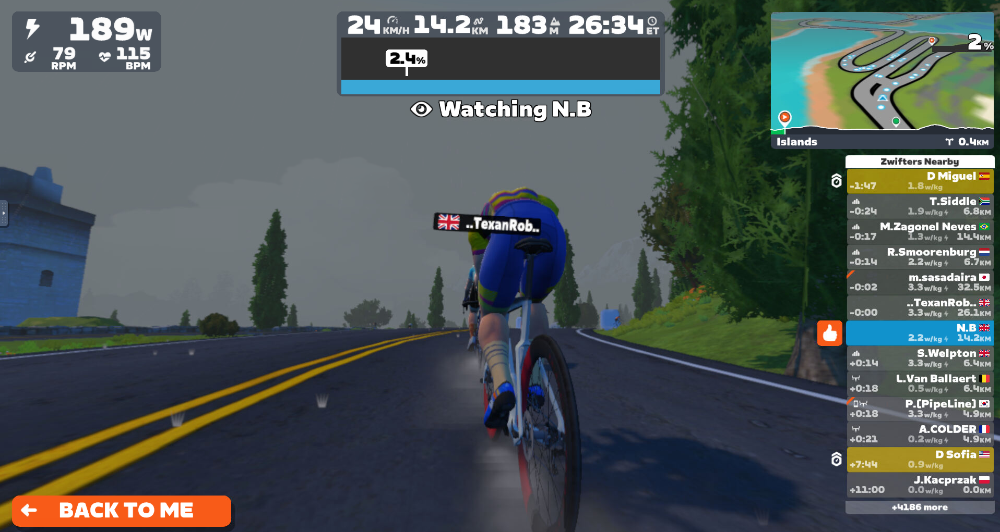
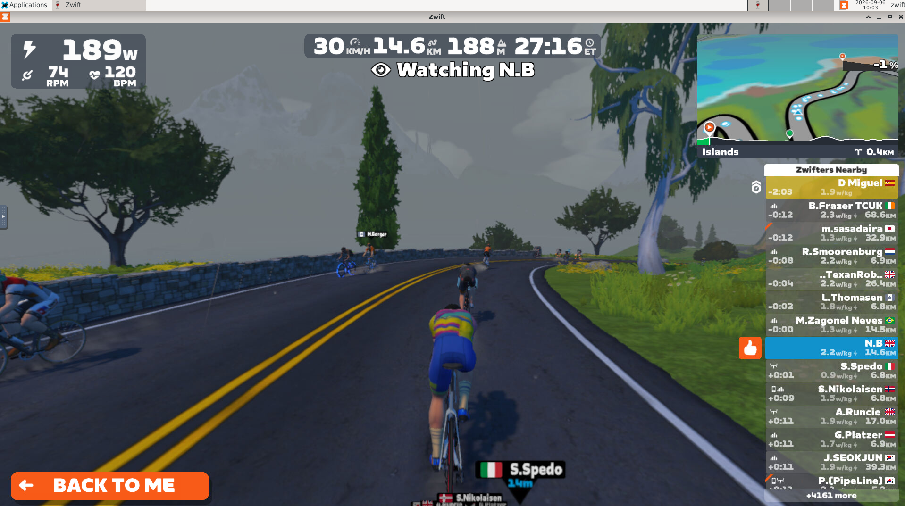
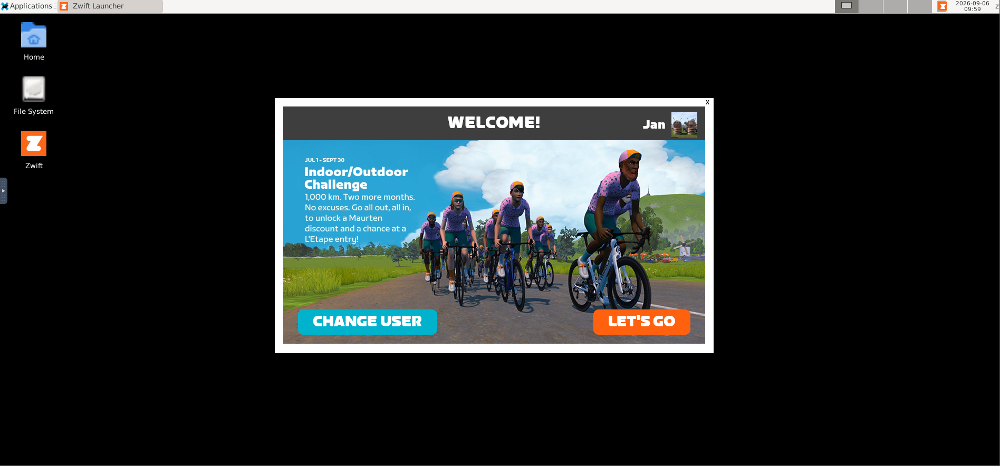
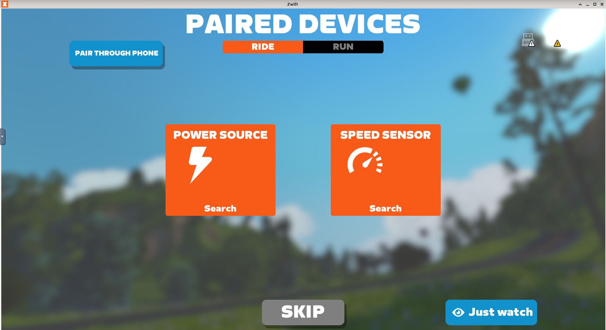
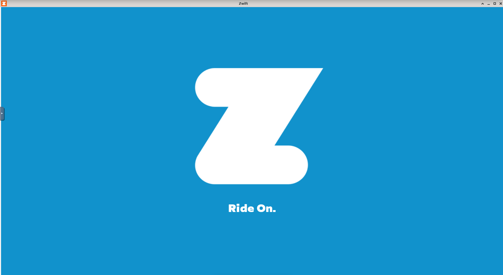

# Zwift on Linux 🚴

Run **Zwift on Linux** using Docker, Wine, XFCE and noVNC.

The container handles Wine setup, required Windows components, WebView2, Zwift installation and updates — with GPU acceleration and browser-based access.

## ✨ Features

* 🐳 Docker-based
* 🍷 Wine 9.9
* 🚴 Automatic Zwift installation & updates
* 🎮 AMD & NVIDIA GPU support
* 🖥️ XFCE desktop
* 🌐 noVNC — use Zwift directly in your browser
* 🔊 PulseAudio / PipeWire audio
* 💾 Persistent Wine & Zwift data
* 🔄 Simple CLI management

## 📸 Screenshots

<p align="center">
  
  
</p>

<p align="center">
  
  
</p>

<p align="center">
  
</p>

## 🚀 Quick start

### Install

```bash
./zwift install
```

### Start

```bash
./zwift start
```

Open **http://localhost:6080** in your browser.

### Stop

```bash
./zwift stop
```

### Restart

```bash
./zwift restart
```

### Update

```bash
./zwift update
```

### Logs

```bash
./zwift logs
```

### Shell

```bash
./zwift shell
```

## 🎮 GPU

### AMD

The container uses the host DRM device:

```bash
--device=/dev/dri:/dev/dri
```

### NVIDIA

With the NVIDIA Container Toolkit:

```bash
--gpus all
```

The same image supports both AMD and NVIDIA GPUs.

## 🔊 Audio

Audio is forwarded from the container to the host's PulseAudio/PipeWire Pulse server.

## 💾 Persistent data

The Wine prefix and Zwift data are stored in a Docker volume:

```text
zwift-data:/home/zwift
```

Recreating the container therefore does not remove the Zwift installation.

## ⚠️ Disclaimer

Zwift is proprietary software. This project does not distribute Zwift or any of its assets. The official Zwift installer is downloaded during installation.

## 📜 License

GNU General Public License v3.0

See [LICENSE](LICENSE) for details.

